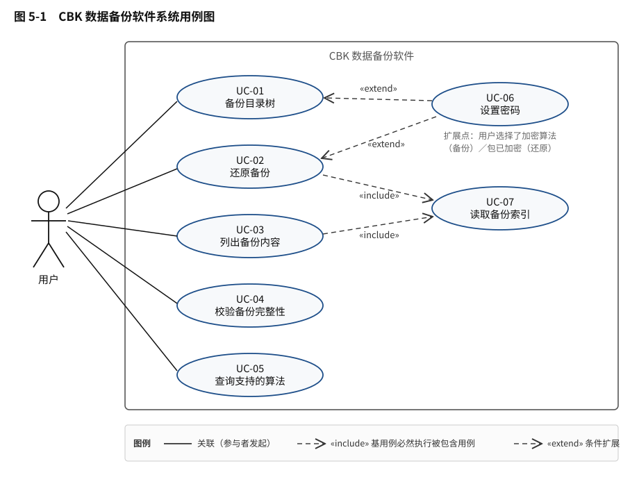
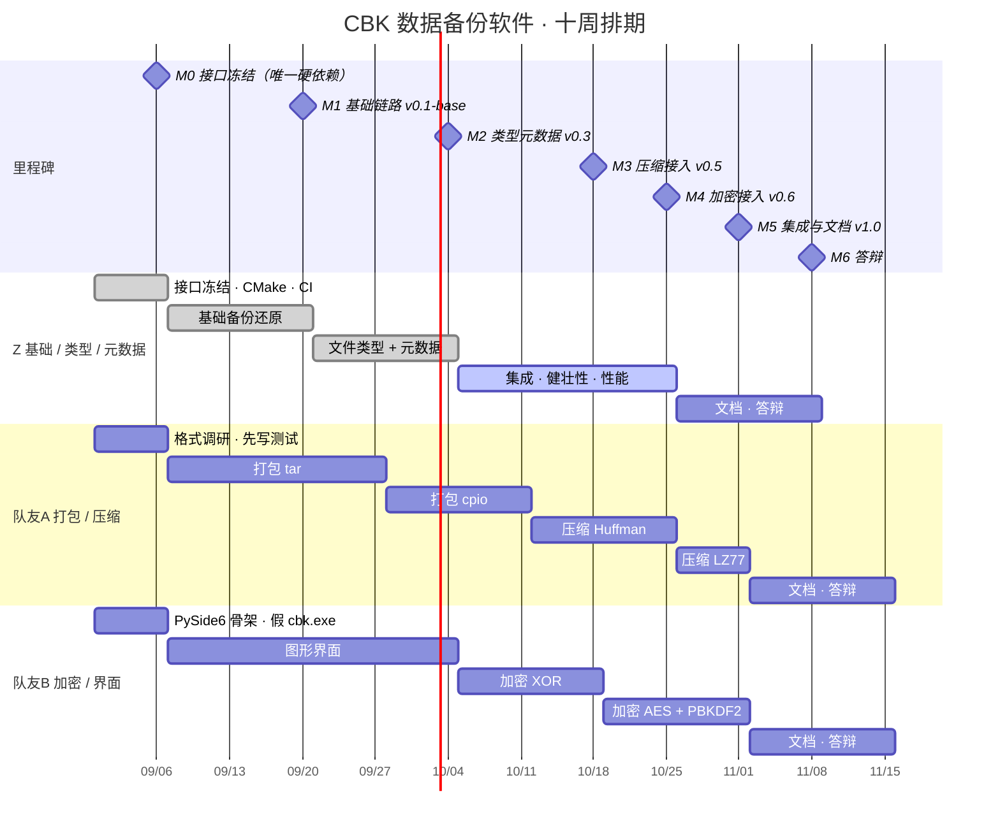

# CBK 数据备份软件 · 需求分析说明书

| 项目名称 | CBK 数据备份软件（Comprehensive Backup Kit） |
|---|---|
| 课程 | 软件开发综合实验 |
| 文档版本 | v1.0 |
| 编写日期 | 2026-09-01 |
| 项目组成员 | [@urab547](https://github.com/urab547)、[@onepiece142575-sudo](https://github.com/onepiece142575-sudo)、[@27588569](https://github.com/27588569) |
| 代码仓库 | https://github.com/urab547/CBK |

---

## 1. 引言

### 1.1 编写目的

本文档面向项目组成员与课程指导教师，用于在编码之前把「软件要做成什么样」固定下来，
并作为后续系统设计文档与软件测试报告的依据。

具体地，本文档回答三个问题：

1. 这个软件为谁解决什么问题，边界在哪里（第 2 章）
2. 它必须具备哪些能力，每项能力凭什么算「做到了」（第 3、4 章）
3. 用户以什么方式与它交互（第 5、6、7 章）

### 1.2 项目背景

数据备份是操作系统之上最基础的一类系统软件。它看起来简单——把文件复制到别处——
但真正的难点不在复制本身，而在于**还原之后的一致性**：

- 一个符号链接被备份还原之后，它应该仍然是一个指向同一目标的链接，而不是一份目标的拷贝
- 三个硬链接指向同一份内容，还原之后应该仍然是同一个文件实体，而不是三份独立的副本
- 文件的修改时间应该精确到原来的那个值，而不是「还原的那一刻」
- 只读、隐藏这些属性以及访问权限，都应当原样回到目标位置

课程要求各组独立实现一款数据备份软件，并自行选择扩展功能。本项目在 Windows 平台上
实现完整的目录树备份与还原，并在此基础上完成文件类型支持、元数据支持、打包解包、
压缩解压、加密解密与图形界面六项扩展。

### 1.3 术语与缩略语

| 术语 | 含义 |
|---|---|
| 容器 / `.cbk` 文件 | 本软件的备份产物。一棵目录树被完整保存成的**单个**文件 |
| 条目（Entry） | 目录树中的一个对象：一个文件、一个目录或一个链接 |
| 打包（Pack） | 把多个条目的元数据与内容拼接进一条字节流，决定「条目边界在哪」 |
| 流水线（Pipeline） | 打包 → 压缩 → 加密这条固定顺序的处理链 |
| 重解析点（Reparse Point） | Windows 上实现符号链接、目录联接等特殊对象的底层机制 |
| 目录联接（Junction） | Windows 特有的目录级链接，语义上接近 Linux 的挂载点 |
| 硬链接（Hard Link） | 指向同一个文件实体的多个目录项 |
| SDDL | 安全描述符定义语言，一种把属主与权限表示成文本的标准格式 |
| FILETIME | Windows 的时间表示，以 100 纳秒为单位 |
| MAX_PATH | Windows 默认的 260 字符路径长度限制 |

### 1.4 参考资料

1. 《软件开发综合实验》课程说明与评分标准
2. Microsoft Docs：File Management、Reparse Points、Access Control Lists
3. 本项目实现方案：`docs/实现方案.md`
4. 本项目排期：`docs/项目进度.md`

---

## 2. 项目概述

### 2.1 产品定位

CBK 是一款运行在 Windows 桌面上的**单机**数据备份工具，面向需要定期保存本地目录、
并要求还原后与原始状态完全一致的个人用户。

产品由两部分组成：

- **命令行程序 `cbk.exe`** —— 承载全部业务逻辑，可独立使用，也可被脚本调用
- **图形界面** —— 通过启动 `cbk.exe` 子进程并解析其输出来工作，只负责收集参数和展示进度

之所以做成这种两层结构而不是把逻辑写进界面，有两个原因：一是课程明确规定后台逻辑
必须使用编译型语言，二是分层之后命令行本身就是一个可以独立测试、独立交付的产物，
界面出问题不影响备份能力。

### 2.2 运行环境

| 项目 | 要求 |
|---|---|
| 操作系统 | Windows 10 1607 及以上（64 位） |
| 文件系统 | 源与目标建议为 NTFS。FAT32 / exFAT 可用，但不支持权限与链接 |
| 运行时 | 无需额外运行时；界面部分需要 Python 3.10+ 与 PySide6 |
| 权限 | 普通用户即可运行。以管理员身份运行可备份更多文件（见 NFR-05） |

### 2.3 设计约束

以下四条来自课程规定，是不可协商的前提，直接影响需求的实现方式：

| 编号 | 约束 | 影响 |
|---|---|---|
| C-01 | 后台逻辑必须使用编译型语言 | 全部业务逻辑用 C++17 实现，脚本语言只用于界面 |
| C-02 | 扩展功能不得直接使用第三方库实现 | 压缩、加密、打包算法全部自行实现，核心库零第三方依赖 |
| C-03 | 流水线顺序固定为「打包 → 压缩 → 加密」 | 加密输出是高熵数据，压缩它不但无效还会变大 |
| C-04 | 容器格式一旦冻结，改动须升版本号 | 保证已生成的备份包始终可读 |

### 2.4 需求范围

**本期实现**（括号内为对应的课程评分项）：

- 基础的数据备份与还原（基础功能）
- 文件类型支持：符号链接、目录联接、硬链接（扩展）
- 元数据支持：属性位、时间戳、属主与权限（扩展）
- 打包解包：自研格式、tar、cpio（扩展）
- 压缩解压：Huffman、LZ77（扩展）
- 加密解密：XOR、AES（扩展）
- 图形界面（扩展）

**本期不实现**，理由见第 9 章：

- 自定义备份（按路径/类型/名字/时间/尺寸/用户筛选）
- 定时备份、实时备份
- 网络备份及其相关功能

---

## 3. 功能性需求

需求编号规则：`FR-<两位序号>`。「优先级」中，**必须**指没有它软件就不成立，
**应当**指影响完整性但可延后，**可选**指锦上添花。

### 3.1 基础功能

| 编号 | 需求 | 优先级 | 验收标准 |
|---|---|---|---|
| FR-01 | 将指定目录树完整保存为单个备份文件 | 必须 | 备份一棵含子目录的树，产物为单个 `.cbk` 文件 |
| FR-02 | 将备份文件还原到指定目录 | 必须 | 还原后目录结构与源一致，文件内容逐字节相同 |
| FR-03 | 备份与还原过程中报告进度 | 必须 | 输出包含已处理条目数、已处理字节数、当前路径 |
| FR-04 | 单个条目失败时跳过并继续，不中断整体 | 必须 | 源目录中含一个不可读文件时，其余文件仍被正确备份 |
| FR-05 | 支持用户中途取消，并清理未完成的产物 | 应当 | 取消后不留下残缺的 `.cbk` 文件 |
| FR-06 | 列出备份文件中的条目清单 | 应当 | 输出每个条目的路径、类型、大小 |
| FR-07 | 校验备份文件的完整性 | 应当 | 文件被篡改一个字节后校验失败并报告 |

### 3.2 文件类型支持

课程要求「支持特定文件系统的特殊文件（管道/链接/设备等）」。这些概念来自 Linux，
在 Windows 上有各自不同的对应物，其中一部分**根本不会出现在目录树中**。
下表是本项目的平台映射分析结论，也是 FR-08 至 FR-11 的依据。

| Linux 概念 | Windows 对应物 | 是否出现在目录树中 | 本项目的处理 |
|---|---|---|---|
| 符号链接 | 符号链接（重解析点，标签 `IO_REPARSE_TAG_SYMLINK`） | 是 | 完整备份还原，区分文件链接与目录链接两种 |
| 硬链接 | 硬链接（同一 MFT 记录被多个目录项引用） | 是 | 检测并去重，还原时重建链接关系 |
| 挂载点 | 目录联接 Junction（标签 `IO_REPARSE_TAG_MOUNT_POINT`） | 是 | 完整备份还原 |
| 命名管道 FIFO | 命名管道，位于 `\\.\pipe\` 命名空间 | **否** | 不在文件系统目录树中，备份目录树时不会遇到 |
| 设备文件 `/dev/*` | 设备对象，位于 `\\.\` 命名空间 | **否** | 同上 |
| —— | 其它重解析点（云盘占位符、应用执行别名等） | 是 | 识别并记录标签，告警后跳过，不递归进入 |

> **关于管道与设备文件**：Windows 把它们放在独立的对象命名空间里，而不是像 Linux
> 那样作为特殊 inode 挂在文件系统上。因此「备份一棵目录树」这个操作在语义上永远
> 不会遇到它们。这是平台差异的分析结论，不是功能缺失。

| 编号 | 需求 | 优先级 | 验收标准 |
|---|---|---|---|
| FR-08 | 备份与还原符号链接，保留其原始目标字符串 | 必须 | 相对链接还原后仍是相对链接，随目录树移动后仍指向正确位置 |
| FR-09 | 区分文件符号链接与目录符号链接 | 必须 | 目录链接还原后仍可穿过它访问目标内容 |
| FR-10 | 备份与还原目录联接 | 必须 | 还原后 `dir /AL` 显示为 JUNCTION，目标路径一致 |
| FR-11 | 检测硬链接并去重存储，还原时重建链接关系 | 必须 | 三个硬链接在包中只存一份内容；还原后三者文件索引相同 |
| FR-12 | 无法识别的特殊对象记录类型标识并告警 | 应当 | 输出中包含该对象的重解析点标签 |
| FR-13 | 默认不跟随链接；可通过选项开启跟随并自动断环 | 应当 | 跟随模式下，指向自身的链接不会导致无限递归 |

### 3.3 元数据支持

| 编号 | 需求 | 优先级 | 验收标准 |
|---|---|---|---|
| FR-14 | 保留文件属性位（只读、隐藏、系统、存档等） | 必须 | 还原后属性位与源完全相同 |
| FR-15 | 保留创建、访问、修改三个时间戳 | 必须 | 还原后时间戳精确到 100 纳秒一致 |
| FR-16 | 保留目录自身的时间戳 | 必须 | 向目录写入内容不会导致其时间戳丢失 |
| FR-17 | 保留属主、属组与访问控制表 | 必须 | 还原后 SDDL 文本与源一致 |
| FR-18 | 保留权限继承的阻断状态 | 应当 | 源端阻断继承的对象，还原后仍然阻断 |
| FR-19 | 提供关闭元数据还原的选项 | 可选 | 指定该选项后只还原内容，不改动目标的时间戳与权限 |

> **关于访问时间**：Windows 可以通过注册表项 `NtfsDisableLastAccessUpdate` 关闭访问
> 时间的自动更新，这是系统默认行为之一。因此访问时间的一致性不作强制验收要求。

> **关于跨机器还原**：权限记录中包含的用户标识（SID）只在生成它的那台机器上有意义。
> 把备份还原到另一台机器时，这些标识会显示为无法解析的账户。这是所有备份软件的
> 固有限制，本软件的做法是原样保留并在遇到时告警，而不是丢弃权限信息。

### 3.4 打包、压缩与加密

| 编号 | 需求 | 优先级 | 验收标准 |
|---|---|---|---|
| FR-20 | 提供至少一种自研打包格式 | 必须 | 手工构造的条目集合打包后能完整解包 |
| FR-21 | 支持 tar、cpio 两种通用打包格式 | 应当 | 同上，且格式符合各自规范 |
| FR-22 | 支持至少两种压缩算法 | 应当 | 随机数据与高重复数据均能无损往返 |
| FR-23 | 支持至少两种加密算法，密码由用户指定 | 应当 | 正确密码可还原；错误密码明确报错而非产出垃圾数据 |
| FR-24 | 算法可自由组合，顺序固定为打包→压缩→加密 | 必须 | 顺序配错时拒绝执行并说明原因 |
| FR-25 | 向调用方报告本程序支持哪些算法 | 必须 | 界面据此动态生成选项，新增算法无需改动界面代码 |

### 3.5 用户界面

| 编号 | 需求 | 优先级 | 验收标准 |
|---|---|---|---|
| FR-26 | 提供命令行接口，覆盖全部功能 | 必须 | 五个子命令均可独立使用 |
| FR-27 | 提供图形界面，覆盖备份与还原 | 应当 | 无需接触命令行即可完成一次完整备份与还原 |
| FR-28 | 界面实时显示进度与告警 | 应当 | 进度条随备份推进平滑更新，告警可见 |

---

## 4. 非功能性需求

| 编号 | 类别 | 需求 | 验收标准 |
|---|---|---|---|
| NFR-01 | 性能 | 内存占用不随单个文件大小增长 | 备份 1 GB 单文件时进程峰值内存与备份小文件时处于同一量级 |
| NFR-02 | 性能 | 支持大规模目录树 | 万级文件的目录树可正常完成备份 |
| NFR-03 | 健壮性 | 深层目录不导致崩溃 | 超过 1000 层的目录树可正常遍历 |
| NFR-04 | 健壮性 | 支持超长路径 | 超过 260 字符的路径可正常读写 |
| NFR-05 | 健壮性 | 权限不足时降级运行而非退出 | 以普通用户身份运行时，可访问的文件仍被正常备份 |
| NFR-06 | 健壮性 | 损坏的备份文件被明确拒绝 | 截断、篡改、格式版本不符的文件均被识别并报错，不崩溃 |
| NFR-07 | 兼容性 | 完整支持中文及各类特殊文件名 | 中文、空格、多点、emoji 文件名均可正确往返 |
| NFR-08 | 安全性 | 密码不出现在命令行参数中 | 通过标准输入传递，其它进程无法从进程列表读取 |
| NFR-09 | 可维护性 | 新增算法不需要改动界面与引擎 | 只需实现接口并在唯一的注册点添加一行 |
| NFR-10 | 可维护性 | 注释率不低于 20% | 由脚本统计核实 |
| NFR-11 | 可测试性 | 核心逻辑可自动化测试 | 单元测试覆盖各模块，可在持续集成中自动执行 |
| NFR-12 | 可移植性 | 备份文件可在不同机器上读取 | 容器格式采用固定字节序与显式字段布局，不依赖编译器 |

---

## 5. 系统用例图

参与者只有一个：**用户**。用户既可以直接使用命令行，也可以通过图形界面操作——
两者触发的是同一组用例，因此不作区分。



图中共七个用例，其中 UC-01 至 UC-05 由用户直接发起，UC-06 与 UC-07 是被包含或
被扩展的内部用例：

- **`«include»`**：基用例执行时**必然**执行被包含的用例。还原与列出内容都必须先读取
  备份索引，因此 UC-07 被这两者包含。
- **`«extend»`**：只在特定条件下才发生。只有当用户选择了加密算法（备份时）或备份包
  本身已加密（还原时），才需要设置密码，因此 UC-06 扩展 UC-01 与 UC-02。

第 6 章为图中每一个用例提供一份描述，编号与名称严格对应，不多不少。

---

## 6. 用例描述

### UC-01 备份目录树

| 项 | 内容 |
|---|---|
| **用例名称** | 备份目录树 |
| **参与者** | 用户 |
| **简述** | 用户选定一个源目录和一个目标位置，系统将该目录树完整保存为单个备份文件 |
| **前置条件** | 源目录存在且可访问；目标位置所在磁盘有足够剩余空间 |
| **后置条件** | 目标位置生成一个可被校验通过的备份文件 |
| **触发** | 用户在界面点击「开始备份」，或执行 `cbk backup` 命令 |

**主成功流程**

1. 用户指定源目录与目标备份文件路径
2. 用户可选地指定打包、压缩、加密算法（不指定则使用默认打包格式、不压缩不加密）
3. 系统校验算法名称是否受支持，以及流水线顺序是否合法
4. 系统尝试提升备份相关权限（失败不影响继续）
5. 系统遍历源目录树，记录每个条目的类型、路径与元数据
6. 系统报告条目总数与字节总数
7. 系统按顺序处理每个条目：读取内容，经打包、压缩、加密写入备份文件
8. 系统在处理过程中持续报告进度
9. 系统写入条目索引与校验信息，关闭备份文件
10. 系统报告最终结果

**扩展流程**

| 编号 | 条件 | 处理 |
|---|---|---|
| 3a | 算法名称不受支持 | 报告参数错误并终止，不创建任何文件 |
| 3b | 流水线顺序不合法（压缩排在加密之后） | 报告参数错误并说明原因，终止 |
| 5a | 源目录不存在或无法访问 | 报告失败并终止 |
| 7a | 某个文件无法打开或读取中途失败 | 记录告警，跳过该条目，继续处理其余条目；最终结果为「部分成功」 |
| 7b | 遇到无法识别的特殊对象 | 记录其类型标识并告警，跳过内容，继续 |
| \*a | 用户请求取消 | 停止处理，删除未完成的备份文件，报告已取消 |
| \*b | 磁盘写满或写入失败 | 删除未完成的备份文件，报告失败 |

**扩展点**：选择了加密算法时，转 UC-06 设置密码

**相关需求**：FR-01、FR-03、FR-04、FR-05、FR-08~FR-17、FR-20~FR-25

---

### UC-02 还原备份

| 项 | 内容 |
|---|---|
| **用例名称** | 还原备份 |
| **参与者** | 用户 |
| **简述** | 用户选定一个备份文件和一个目标目录，系统将备份内容还原到该目录 |
| **前置条件** | 备份文件存在且格式有效；目标目录可写 |
| **后置条件** | 目标目录中的内容、结构与元数据与备份时的源目录一致 |
| **触发** | 用户在界面点击「开始还原」，或执行 `cbk restore` 命令 |

**主成功流程**

1. 用户指定备份文件与目标目录
2. 系统读取备份文件头部，识别其使用的算法组合（**包含 UC-07**）
3. 系统按记录的算法组合建立逆向处理链
4. 系统建立目标目录下的全部子目录，此时不设置任何元数据
5. 系统按条目顺序还原内容：普通文件写入数据，链接与联接重建链接关系，硬链接重建引用
6. 系统为每个条目设置其时间戳、权限与属性位
7. 系统逆序遍历目录列表，设置每个目录的时间戳、权限与属性位
8. 系统报告最终结果

> 第 4、5、7 步之所以分成三趟而不是一趟做完，是因为存在三个会**静默出错**的顺序
> 约束：向目录写入文件会刷新目录的修改时间；设置只读属性之后就无法再修改时间戳
> 和权限；硬链接必须在其指向的条目还原之后才能建立。系统设计文档中有详细论证。

**扩展流程**

| 编号 | 条件 | 处理 |
|---|---|---|
| 2a | 文件不是有效的备份文件 | 报告失败并说明原因，终止 |
| 2b | 备份文件的格式版本本程序不支持 | 报告版本不匹配，终止 |
| 3a | 备份使用了本程序不支持的算法 | 报告失败并列出本程序支持的算法，终止 |
| 3b | 密码错误 | 解密失败，报告失败，终止 |
| 5a | 目标位置已存在同名文件 | 按用户选择的策略处理：跳过、覆盖或改名 |
| 5b | 无权限创建符号链接 | 降级创建占位对象并告警，继续处理其余条目 |
| 5c | 硬链接的目标位于不同磁盘卷 | 降级为复制一份内容并告警，说明二者不再是同一实体 |
| 5d | 某条目的内容校验和与记录不符 | 记录告警，继续处理其余条目 |
| 6a | 权限不足以设置属主 | 只还原访问控制表，告警说明属主未还原 |
| \*a | 用户请求取消 | 停止处理，已还原的部分保留在目标目录中 |

**扩展点**：备份包已加密时，转 UC-06 设置密码

**相关需求**：FR-02、FR-03、FR-04、FR-05、FR-08~FR-19

---

### UC-03 列出备份内容

| 项 | 内容 |
|---|---|
| **用例名称** | 列出备份内容 |
| **参与者** | 用户 |
| **简述** | 用户在不还原的前提下，查看一个备份文件里都有些什么 |
| **前置条件** | 备份文件存在且格式有效 |
| **后置条件** | 无（只读操作，不改变任何状态） |
| **触发** | 用户在界面选择「查看内容」，或执行 `cbk list` 命令 |

**主成功流程**

1. 用户指定备份文件
2. 系统读取备份文件的头部与索引（**包含 UC-07**）
3. 系统输出备份的来源目录、所用算法、条目总数
4. 系统逐条输出条目的类型、大小与相对路径

**扩展流程**

| 编号 | 条件 | 处理 |
|---|---|---|
| 2a | 文件不是有效的备份文件 | 报告失败并说明原因 |
| 2b | 索引区解析失败 | 报告备份文件已损坏或密码不正确 |
| 4a | 调用方要求机器可读格式 | 以结构化格式输出，供界面解析 |

**相关需求**：FR-06

---

### UC-04 校验备份完整性

| 项 | 内容 |
|---|---|
| **用例名称** | 校验备份完整性 |
| **参与者** | 用户 |
| **简述** | 用户确认一个备份文件是否完好，未被截断或篡改 |
| **前置条件** | 备份文件存在 |
| **后置条件** | 无（只读操作） |
| **触发** | 用户在界面点击「校验」，或执行 `cbk verify` 命令 |

**主成功流程**

1. 用户指定备份文件
2. 系统读取文件头部与尾部，校验标识、版本号与各区域大小是否自洽
3. 系统重新计算头部、数据区、索引区三处的校验和
4. 系统将计算结果与文件中记录的校验和逐一比对
5. 系统报告校验通过

**扩展流程**

| 编号 | 条件 | 处理 |
|---|---|---|
| 2a | 文件太小、标识错误或版本不符 | 报告不是有效的备份文件，终止 |
| 2b | 各区域大小与文件实际长度不符 | 报告文件可能被截断，终止 |
| 4a | 任一校验和不匹配 | 报告该区域已损坏 |

> 第 2 步与第 3 步是有意分开的：结构性检查只需读取几百字节即可完成，而校验和计算
> 需要读完整个文件。先做便宜的检查，一个 100 GB 的损坏备份能在毫秒级被拒绝。

**相关需求**：FR-07、NFR-06

---

### UC-05 查询支持的算法

| 项 | 内容 |
|---|---|
| **用例名称** | 查询支持的算法 |
| **参与者** | 用户 |
| **简述** | 查询本程序当前支持哪些打包、压缩与加密算法 |
| **前置条件** | 无 |
| **后置条件** | 无 |
| **触发** | 图形界面启动时自动查询；用户也可直接执行 `cbk info` 命令 |

**主成功流程**

1. 系统输出容器格式版本号
2. 系统按打包、压缩、加密三类，分别输出已注册的算法名称

> 这个用例的意义在于**界面不硬编码算法列表**。新增一种压缩算法时，只需在后台注册，
> 界面下拉框自动多出一个选项，界面代码一行都不用改。

**相关需求**：FR-25、NFR-09

---

### UC-06 设置密码

| 项 | 内容 |
|---|---|
| **用例名称** | 设置密码 |
| **参与者** | 用户 |
| **类型** | 扩展用例（扩展 UC-01 与 UC-02） |
| **简述** | 在备份需要加密、或还原需要解密时，由用户提供密码 |
| **前置条件** | 备份时选择了加密算法，或所还原的备份包已加密 |
| **后置条件** | 密码被传递给加密算法，且未在任何进程可见的位置留下痕迹 |

**主成功流程**

1. 系统提示用户输入密码
2. 用户输入密码
3. 系统通过标准输入把密码传给后台程序
4. 加密算法据此派生密钥

**扩展流程**

| 编号 | 条件 | 处理 |
|---|---|---|
| 2a | 用户未输入密码 | 视为空密码交由算法处理，或提示重新输入 |
| 4a | 还原时密码不正确 | 解密结果无法通过校验，报告密码错误 |

> **密码绝不通过命令行参数传递**。Windows 上其它进程可以读取任意进程的完整命令行，
> 把密码写在参数里等同于明文广播。

**相关需求**：FR-23、NFR-08

---

### UC-07 读取备份索引

| 项 | 内容 |
|---|---|
| **用例名称** | 读取备份索引 |
| **参与者** | 无（内部用例） |
| **类型** | 被包含用例（被 UC-02 与 UC-03 包含） |
| **简述** | 从备份文件中解析出全部条目的元数据清单 |
| **前置条件** | 备份文件的头部已被正确解析 |
| **后置条件** | 内存中得到完整的条目清单 |

**主成功流程**

1. 从文件头部取得索引区的位置与大小
2. 按备份时记录的算法组合，建立解密与解压的逆向处理链
3. 读取索引区并逐条解析条目元数据
4. 校验解析出的条目数量与头部记录的数量是否一致

**扩展流程**

| 编号 | 条件 | 处理 |
|---|---|---|
| 3a | 某条记录的字段不完整或取值非法 | 报告备份文件已损坏 |
| 4a | 条目数量与头部记录不符 | 报告备份文件已损坏或被截断 |

> 索引区之所以放在文件尾部而不是头部，是因为备份是流式写入的——只有写完最后一个
> 文件才知道每个条目的最终大小和位置。放在尾部就不需要为每个条目回头改写文件。

**相关需求**：FR-02、FR-06

---

## 7. 用户交互方式设计

### 7.1 总体设计

软件提供两条彼此独立的交互通道：

```
           ┌──────────────────┐
   用户 ───┤  图形界面（PySide6）│───┐
           └──────────────────┘   │ 启动子进程 + 解析输出
                                  ▼
           ┌───────────────────────────────┐
   用户 ───┤        cbk.exe（命令行）        │
           └───────────────────────────────┘
                          │
                          ▼
                   备份文件 / 目标目录
```

两条通道触发的是同一套逻辑。这样安排的直接好处是：**图形界面不可用时，全部功能仍然
可以通过命令行完成**；反过来，命令行的每一个能力都能被界面调用，不存在只有界面才能
做到的操作。

### 7.2 命令行接口

```
用法: cbk <命令> [选项]

命令:
  backup   --source <目录> --dest <文件.cbk>
           [--packer <名字>] [--compress <名字>] [--encrypt <名字>]
           [--password-stdin] [--follow-symlinks] [--progress json]
  restore  --archive <文件.cbk> --dest <目录>
           [--password-stdin] [--overwrite skip|force|rename]
           [--no-metadata] [--progress json]
  list     --archive <文件.cbk> [--json] [--password-stdin]
  verify   --archive <文件.cbk>
  info     输出本程序支持的算法列表
```

**退出码**约定如下。界面据此判断该显示成功、警告还是错误：

| 退出码 | 含义 | 界面应当如何呈现 |
|---|---|---|
| 0 | 全部成功 | 成功提示 |
| 1 | 部分成功——备份文件可用，但有条目被跳过 | 成功提示 + 可展开的告警清单 |
| 2 | 失败——产物不可用 | 错误提示 + 失败原因 |
| 3 | 参数错误 | 这属于调用方的缺陷，应当在开发阶段暴露 |

**进度输出**采用逐行的结构化文本，每行一条完整记录，写出后立即刷新缓冲区。
共四类记录：任务开始（含总量）、进度推进、告警、最终结果。

> 之所以强调「立即刷新」：不刷新的话输出会积压在管道缓冲区里，界面上的进度条会
> 长时间不动，然后在进程结束的瞬间跳到 100%。

### 7.3 图形界面

界面分为「备份」和「还原」两个页签，布局如下（示意）：

```
┌─ CBK 数据备份 ────────────────────────────────────┐
│  [ 备份 ]  [ 还原 ]                                │
├───────────────────────────────────────────────────┤
│  源目录      [ D:\我的文档            ] [ 浏览… ]   │
│  备份到      [ E:\backup\2026-09.cbk  ] [ 浏览… ]   │
│                                                    │
│  打包格式    [ cbk-native  ▾ ]                     │
│  压缩算法    [ 不压缩      ▾ ]                     │
│  加密算法    [ 不加密      ▾ ]  密码 [········]     │
│                                                    │
│  □ 跟随符号链接                                     │
├───────────────────────────────────────────────────┤
│  ▓▓▓▓▓▓▓▓▓▓▓▓▓░░░░░░░░  62%   1,284 / 2,057 项      │
│  正在处理：子目录\报告.docx                          │
│                                                    │
│  ⚠ 2 条告警  [ 展开 ]                               │
├───────────────────────────────────────────────────┤
│                        [ 取消 ]  [ 开始备份 ]       │
└───────────────────────────────────────────────────┘
```

界面设计遵循三条原则：

1. **三个算法下拉框的内容在启动时向后台查询**（UC-05），不写死在界面代码里。
   新增算法后界面自动出现新选项。
2. **密码框的内容不进入命令行**，而是在子进程启动后写入其标准输入。
3. **告警默认折叠**。一次备份可能产生大量告警（例如系统目录中的大量不可访问文件），
   全部展开会淹没真正重要的信息，但也不能不显示。

还原页签的结构类似，算法选项替换为覆盖策略（跳过 / 覆盖 / 改名）与「不还原元数据」
开关，并额外提供一个「先查看内容」按钮（UC-03）。

> 界面的具体视觉设计由界面负责人在实现阶段确定，本节约定的是**信息结构与交互契约**——
> 哪些信息必须呈现、哪些数据必须来自后台查询、哪些操作必须可用。

---

## 8. 项目规划甘特图

项目周期十周，自 2026-08-31 起至 2026-11-08 答辩。三名成员并行推进，
唯一的硬依赖是第一周的接口冻结：接口头文件合入主分支后，三条工作线才能各自展开。

> 本图与 `docs/项目进度.md` 同源。进度变化时请两处同步更新。



**读图说明**：三个 section 对应三名成员。M1 至 M5 是合并点，含义是「三条分支合入
主分支，跑一遍完整的备份还原，打一个版本标签」。合并点不要求每人都完成当期全部工作，
唯一的硬性要求是合入主分支的代码必须能够构建并通过全部测试。

> 第 6 周与国庆假期重叠，该周产出按半周估算。

---

## 9. 已评估但不纳入本期的需求

以下需求经过评估后决定不在本期实现。记录在此是为了说明这是**权衡的结果**而非遗漏。

| 需求 | 不做的理由 |
|---|---|
| 自定义备份（按路径/类型/名字/时间/尺寸/用户筛选） | 实现成本低（在遍历阶段增加过滤条件即可），但当前已选扩展功能的总量已经达到难度分上限，继续增加不再提升得分。作为进度落后时的备选方案保留 |
| 定时备份 | 需要引入任务调度与备份集淘汰策略，涉及一套独立的配置持久化机制，规模接近一个子项目 |
| 实时备份 | 需要监听文件系统变更通知并处理事件风暴与去抖，复杂度高于团队在剩余周期内可承担的范围 |
| 网络备份 | 需要设计传输协议、用户体系与服务端，本质上是另一个项目 |
| 增量备份 | 依赖网络备份的整体架构，单机模式下收益有限 |
| 保留审计信息（SACL） | 读取需要特殊权限，且与本软件「还原后一致」的核心目标关联很弱 |

---

## 10. 需求追踪矩阵

本表用于确认三件事：每条需求都有用例承载、每个用例都有需求来源、每条需求都有验证手段。
后续的系统设计文档与测试报告应当能够沿着这张表向下追溯。

| 需求 | 承载用例 | 验证方式 |
|---|---|---|
| FR-01 备份为单个文件 | UC-01 | 端到端测试 + 演示 |
| FR-02 还原到指定目录 | UC-02（含 UC-07） | 往返测试 |
| FR-03 报告进度 | UC-01、UC-02 | 输出记录检查 |
| FR-04 单条失败不中断 | UC-01 | 异常测试：不可读文件 |
| FR-05 取消并清理 | UC-01 | 异常测试：中途取消 |
| FR-06 列出内容 | UC-03（含 UC-07） | 功能测试 |
| FR-07 校验完整性 | UC-04 | 异常测试：篡改字节 |
| FR-08~09 符号链接 | UC-01、UC-02 | 往返测试：绝对/相对、文件/目录 |
| FR-10 目录联接 | UC-01、UC-02 | 往返测试 |
| FR-11 硬链接去重 | UC-01、UC-02 | 往返测试：比对文件索引 |
| FR-12 未知特殊对象 | UC-01 | 输出记录检查 |
| FR-13 跟随与断环 | UC-01 | 边界测试：自引用链接 |
| FR-14~16 属性与时间戳 | UC-01、UC-02 | 往返测试：100 纳秒级比对 |
| FR-17~18 属主与权限 | UC-01、UC-02 | 往返测试：SDDL 文本比对 |
| FR-19 关闭元数据还原 | UC-02 | 功能测试 |
| FR-20~23 各类算法 | UC-01、UC-02 | 各算法的往返测试 |
| FR-24 流水线顺序 | UC-01 | 异常测试：顺序配错 |
| FR-25 查询算法 | UC-05 | 功能测试 |
| FR-26 命令行接口 | UC-01~UC-05 | 各命令的功能测试 |
| FR-27~28 图形界面 | UC-01~UC-03 | 手工验收 + 演示 |
| NFR-01~02 性能 | UC-01 | 性能测试 |
| NFR-03~07 健壮性与兼容性 | UC-01、UC-02 | 边界测试与异常测试 |
| NFR-08 密码不入命令行 | UC-06 | 手工核查进程命令行 |
| NFR-09 算法可插拔 | UC-05 | 新增算法后界面自动更新 |
| NFR-10 注释率 | —— | 脚本统计 |
| NFR-11 可测试性 | —— | 持续集成中自动执行 |
| NFR-12 格式可移植 | UC-02 | 单元测试：字节序与布局 |
