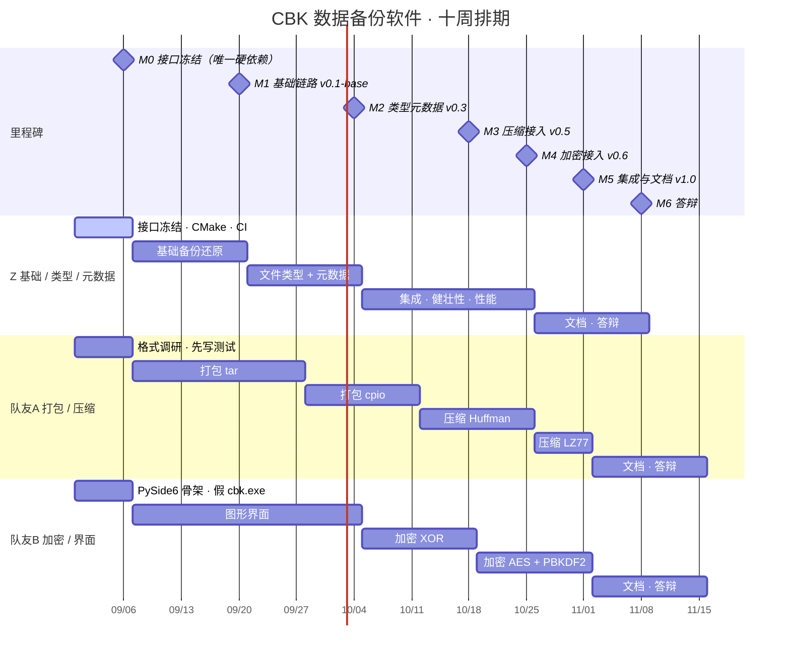

# CBK 项目进度

这张甘特图是**代码**，不是图片。GitHub 会自动把下面这段渲染成一张真的甘特图，
你在网页上看到的就是图。进度变了就改这几行文字，图跟着变，
而且改了什么、谁改的、什么时候改的，git 全都记着。

需求分析说明书里要的「项目规划甘特图」直接截这张图。

> 注意：第 6 周与国庆假期重叠，那一周的产出按半周算比较稳妥。

## 怎么读这张图

三条 section 就是三个人，各自的条子是各自的活。**只有 M0 是真正的硬依赖**——
Z 在第一周把接口头文件合进 `main`，A 和 B 才知道要实现什么函数。
之后三条线各走各的，M1 到 M5 是**合并点**：三条分支合进 `main`，
跑一遍完整的备份还原，打一个 tag。

合并点不要求每个人都做完当期的活。A 的 cpio 没写完，M2 照样合，
合进去的是当时能跑的 tar。唯一的要求是：合进 `main` 的东西必须能构建、能过测试。

## 怎么改

用任何文本编辑器打开这个文件改数字就行。几个常用写法：

- `:z2, after z1, 14d` — 接在 z1 后面，持续 14 天
- `:z2, 2026-09-07, 14d` — 指定开始日期
- `:done, z1, ...` — 已完成，会显示成灰色
- `:active, z1, ...` — 进行中，会高亮
- `:crit, z1, ...` — 关键路径，会标红
- `:milestone, m0, 日期, 0d` — 一个菱形的里程碑点

改完 commit 推上去，GitHub 上的图立刻就变了。
